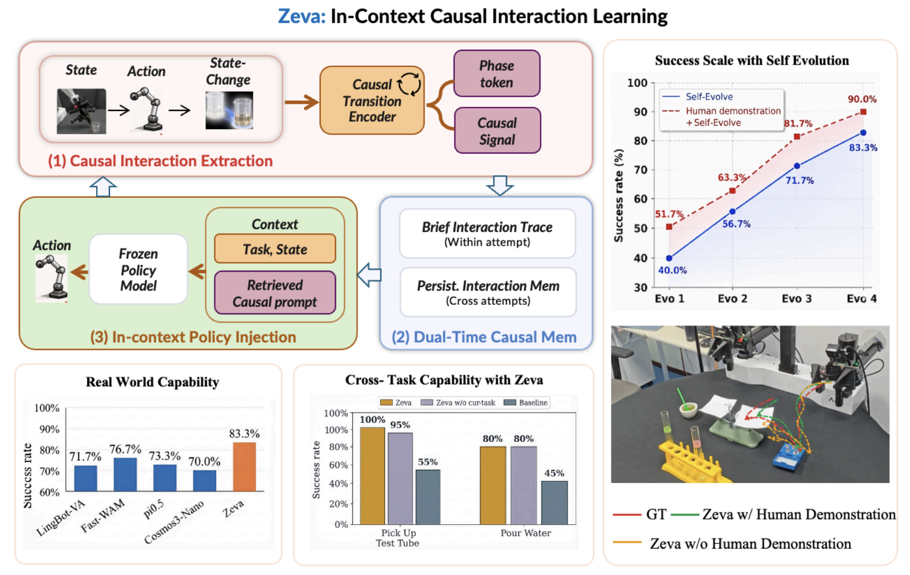

# zeva

**In-Context Causal Learning for Generalizable Embodied Manipulation**

[Project page](https://air-embodied-brain.github.io/Zeva) ·
[Model weights](https://huggingface.co/chen123fu/zeva) ·
[Atomic5 reproduction](docs/reproduce.md) ·
[Cross-attempt reproduction](docs/zeva_pim.md)

---

## Overview

zeva enables a frozen robot policy to learn from its own physical interaction
experience at deployment time. Instead of updating model parameters, zeva
extracts action-induced state changes, stores them in a dual-timescale causal
memory, and retrieves relevant interaction evidence as context for subsequent
actions.



## Method

zeva implements **In-Context Causal Learning (ICCL)** in three parts:

1. **Causal Interaction Extraction.** A Causal Transition Encoder (CTE)
   integrates visual state, executed action, and observed state change. It
   produces a phase token \(p_\tau\) and a causal interaction signal
   \(e_\tau\). CTE is trained with causal-effect prediction, task-identity
   clustering, and phase-progression objectives.
2. **Dual-timescale Causal Memory.** A Brief Interaction Trace (BIT) retains
   recent evidence within an attempt, while Persistent Interaction Memory (PIM)
   consolidates phase/effect evidence across attempts in the same episode.
3. **In-Context Policy Injection.** Phase-conditioned retrieval selects relevant
   PIM entries. A memory encoder fuses the task, current phase, BIT, and retrieved
   PIM evidence into a Causal Prompt \(M_\tau\) for the diffusion policy.

> [!IMPORTANT]
> During deployment, all neural parameters remain frozen. Only BIT and PIM are
> updated online.

## Installation

zeva is released as an overlay for
[NVIDIA Cosmos Framework](https://github.com/NVIDIA/cosmos-framework) at commit
`ee58e41467f33c49ddde08b4d0ef4923876a95ac`.

```bash
git clone https://github.com/NVIDIA/cosmos-framework.git
cd cosmos-framework
git checkout ee58e41467f33c49ddde08b4d0ef4923876a95ac
cd ..

git clone https://github.com/dsdfasfaac/zeva-test.git zeva
rsync -a --exclude=.git --exclude=README.md zeva/ cosmos-framework/
cd cosmos-framework
```

Install the remaining Cosmos Framework dependencies following the upstream
[setup instructions](https://github.com/NVIDIA/cosmos-framework/blob/main/docs/setup.md).

## Reproduction

> [!NOTE]
> The released checkpoint was trained on success-only trajectories and
> evaluated without cross-attempt self-evolution. Its benchmark success rate
> therefore measures the frozen policy rather than improvement from accumulated
> PIM experience.

### Atomic5 benchmark reproduction

Follow [docs/reproduce.md](docs/reproduce.md) to start the frozen policy server
and reproduce the locked five-task evaluation. The released protocol uses a
32-action horizon, 30 UniPC steps, guidance 3.0, shift 5.0, and no retries.

### Fixed-seed cross-attempt evolution

Follow [docs/zeva_pim.md](docs/zeva_pim.md) to run PIM-enabled evaluation on a
fixed episode. Each case below was reproduced twice from empty PIM; `F` denotes
failure and `S` denotes success.

> [!NOTE]
> The current release includes these reproducible case studies.

| Task | Seed | Attempt sequence |
| --- | ---: | --- |
| OpenStandMixerHead | 199 | `FSSSS` |
| TurnOnElectricKettle | 197 | `FSSSSS` |
| CloseToasterOvenDoor | 199 | `FFFSSSSSSSS` |
| TurnOnMicrowave | 200 | `FFFFSSSS` |
| CoffeeSetupMug | 204 | `FFFFFFFFFSSSS` |

Validate an exported pair of runs with:

```bash
python experiment_manifests/verify_pim_evolve_case.py \
  --first /path/to/first_run \
  --repeat /path/to/repeat_run \
  --task TurnOnElectricKettle \
  --seed 197
```

## Repository layout

| Path | Description |
| --- | --- |
| `cosmos_framework/model/zeva/` | CTE, BIT, PIM, retrieval, Causal Prompt, and policy injection |
| `cosmos_framework/scripts/` | Policy servers and RoboCasa365 evaluators |
| `experiment_manifests/` | Locked evaluation and verification utilities |
| `examples/` | Training launchers and experiment configurations |
| `docs/reproduce.md` | Atomic5 reproduction protocol |
| `docs/zeva_pim.md` | PIM and cross-attempt case studies |

## Citation

If you find this work useful, please cite:

```bibtex
@misc{chen2026zeva,
  title  = {zeva: In-Context Causal Learning for Generalizable Embodied Manipulation},
  author = {Fu Chen and Xin Ding and Bingjia Huang and Xiangyu Li and
            Mingju Wang and Jiawei He and Kun Li and Wei Sun and
            Yunxin Liu and Hao Wu and Ting Cao},
  year   = {2026}
}
```

## Acknowledgements

zeva builds on the following open-source projects:

- [NVIDIA Cosmos Framework](https://github.com/NVIDIA/cosmos-framework)
- [RoboCasa365](https://github.com/robocasa/robocasa)
- [BehaviorVLA](https://github.com/iLearn-Lab/ICML26-BehaviorVLA)

Please follow the licenses and citation requirements of all external models,
datasets, simulators, and software dependencies.

## License

This repository is released under the included [OpenMDW-1.1 license](LICENSE).
External models, datasets, and simulators remain subject to their respective
licenses.
